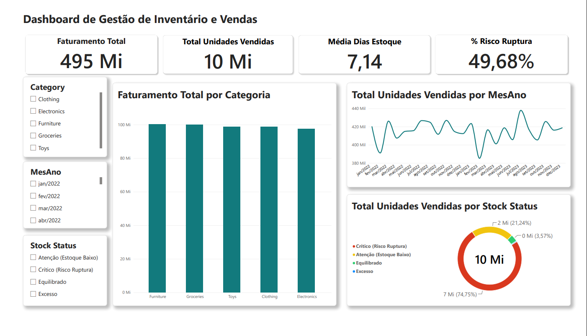

# 📦 Supply Chain & Inventory Analytics: Diagnóstico de Ruptura e Otimização de Abastecimento


## 📌 Resumo Executivo
Este projeto desenvolve uma solução ponta a ponta (*End-to-End*) de **Inteligência de Suprimentos e Gestão de Inventário** para uma rede varejista multicanal (5 lojas, 20 SKUs em 5 categorias e 4 regiões). 

A análise abrange **73.100 registros diários de operação (2022-2024)** e identifica um problema estrutural severo: **49,68% dos registros operam em nível crítico de estoque (<= 2 dias de cobertura)**. O diagnóstico comprovou que a causa raiz do risco de ruptura não é a volatilidade de demanda promocional ou sazonalidade, mas sim um **desalinhamento crônico na política de compras/reposição** (Units Ordered ~ 110 un. vs. Units Sold ~ 136 un.).

---

## 🎯 Contexto e Desafios de Negócio
A operação do varejo enfrentava riscos constantes de desabastecimento sem uma visão clara sobre a origem da falha. As principais perguntas que este projeto responde são:
1. **Qual é o nível real de risco de ruptura da operação e como ele se distribui na Curva ABC de produtos?**
2. **Existe impacto de volatilidade causada por campanhas promocionais, descontos ou fatores climáticos no esgotamento do estoque?**
3. **A falha é operacional/logística (reposição insuficiente) ou mercadológica (picos imprevisíveis de demanda)?**
4. **Qual é o impacto financeiro do risco de desabastecimento nos SKUs de maior faturamento?**


## 🛠️ Tecnologias e Ferramentas

* **Engenharia & Análise de Dados:** Python (Pandas, Kaggle API), SQL (SQLite, Views)
* **Visualização & Modelagem:** Power BI (DAX, Modelo Star Schema, dCalendario)
* **Suporte & Produtividade:** **Gemini (Google AI)** — Utilizado como assistente de inteligência artificial (*AI Copilot*) no refinamento de scripts Python/SQL, revisão estrutural da documentação e validação das hipóteses de negócio de Supply Chain.
* **Versionamento:** Git & GitHub


## 📊 Visualização do Dashboard & Análises



> **Destaques do Painel Executivo:**
> * **KPIs Globais:** Monitoramento em tempo real de Faturamento ($495Mi), Volume Vendido (10Mi un.), Cobertura Média (7,14 dias) e % de Risco de Ruptura (49,68%).
> * **Faturamento por Categoria:** Identificação dos vetores de receita com liderança de *Furniture* e *Groceries* (~$100Mi cada).
> * **Tendência Temporal de Vendas:** Acompanhamento da sazonalidade e volumes mensais (~400k a 440k un./mês).
> * **Matriz de Status de Estoque:** Mapeamento visual indicando que 74,75% do volume negociado opera em faixas de atenção/crítica de reposição.


## 🔍 Análises de Negócio & Insights Estratégicos

### 1. Análise de Causa Raiz: Falha Logística vs. Volatilidade Promocional
* **Diagnóstico:** Havia a suspeita inicial de que o alto risco de ruptura (49,68%) fosse causado por picos imprevisíveis de demanda em dias promocionais ou feriados (`Holiday/Promotion`).
* **Constatação:** A análise revelou que a média de vendas em dias sem promoção é de **136,50 un.** e em dias com promoção é de **136,42 un.** (praticamente idênticas). A taxa de risco crítico também se manteve idêntica (**49,75% vs. 49,61%**).
* **Conclusão:** A causa raiz do desabastecimento é um **déficit estrutural na política de compras**: os lotes médios de reposição (`Units Ordered` = 110 un.) cobrem apenas **80,8% da demanda média diária** (136 un.), gerando sangria contínua no estoque de segurança.

---

### 2. Análise da Curva A: Exposição Financeira nos SKUs de Maior Faturamento
* **Diagnóstico:** Avaliação do impacto do desabastecimento nos produtos de maior relevância financeira para a empresa.
* **Constatação:** Os 10 principais SKUs em receita representam mais de **$53 Milhões em faturamento**, porém todos operam em estado crítico de estoque em **mais de 50% dos dias analisados**.
* **Destaque Crítico:** O produto líder de vendas (`P0014 - Toys`, receita de $5,51M) permaneceu **406 dias em nível crítico de estoque (53,42% do tempo)**, gerando altíssimo risco de custo de oportunidade por falta de produto (*Out-of-Stock*).

---

### 3. Análise Geográfica e por Loja: Risco Sistêmico na Cadeia de Suprimentos
* **Diagnóstico:** Verificação se o problema de ruptura estava concentrado em alguma região específica ou se era isolado em determinadas unidades.
* **Constatação:** Todas as 5 lojas apresentaram volume de vendas homogêneo (~$24M a $25.9M por combinação regional) e um percentual de risco de ruptura consistente, variando estritamente na faixa de **48% a 51%**.
* **Conclusão:** O problema não é uma falha operacional local de uma loja específica, mas sim um **problema sistêmico na Gestão do Centro de Distribuição (CD)** e no cálculo do Ponto de Pedido (*Reorder Point*) para toda a rede.

---

### 4. Análise do Modelo de Previsão de Demanda (Demand Forecast)
* **Diagnóstico:** Avaliação da acurácia e sanidade dos dados de previsão que alimentavam o setor de planejamento de compras.
* **Constatação:** No processo de ETL (Python), foram identificados 673 registros (0,92%) com valores **negativos no forecast**, além de um erro médio consistente (`Forecast Error` ~ -5,06 unidades).
* **Conclusão:** O algoritmo legado de *Demand Forecast* está subestimando a demanda real, fazendo com que o time de compras emita pedidos menores do que o necessário para suprir o volume de vendas diário.

---
> 💡 **Impacto no Negócio: Por que operar com 74,75% em Risco Crítico afeta a Lucratividade real?**
>
> Embora o faturamento bruto atinja **$495M**, operar no limite da ruptura esconde perdas financeiras silenciosas:
> 
> 1. **Custo do "Lucro Invisível" Perdido (*Out-of-Stock Cost*):**
>    Com 74,75% dos itens operando com $\le 2$ dias de cobertura, qualquer atraso logístico gera prateleiras vazias. Se o cliente não encontra o produto líder (ex: `P0014`), ele compra no concorrente. Estima-se que a receita poderia superar **$550M** apenas garantindo a disponibilidade dos SKUs de Curva A na gôndola.
>
> 2. **Destruição da Margem por Fretes Emergenciais:**
>    Para combater o risco iminente de desabastecimento, o time de Supply Chain é forçado a acionar fretes fracionados/expressos e horas extras no Centro de Distribuição. O aumento do custo operacional (OPEX) devora a margem de lucro líquido da empresa.
>
> 3. **Perda de LTV (*Lifetime Value*) e Imagem de Marca:**
>    Encontrar prateleiras vazias de forma recorrente destrói a fidelidade do consumidor. Como a aquisição de novos clientes no varejo custa de **5 a 7 vezes mais** do que a retenção, a ruptura crônica afeta diretamente o valor do cliente no longo prazo.
## 🔬 Metodologia e Pipeline de Dados

```
┌────────────────────────────────┐     ┌────────────────────────────────┐     ┌────────────────────────────────┐
│   1. ETL & EDA (Python)        │ ──► │   2. Data Modeling (SQL)       │ ──► │   3. Data Viz & DAX (Power BI) │
│ • Extração via Kaggle API      │     │ • Povoamento em SQLite         │     │ • Modelo Dimensional (Star)    │
│ • Limpeza de anomalias (0.92%) │     │ • Queries de Curva ABC         │     │ • Medidas DAX de Negócio       │
│ • Feature Engineering (KPIs)   │     │ • Agregações via Views         │     │ • Dashboard Executivo          │
└────────────────────────────────┘     └────────────────────────────────┘     └────────────────────────────────┘
``` 
## 1. Processamento e Sanitização de Dados (Python)
- Tratamento de Anomalias: Identificação e ajuste de 673 registros (0,92%) que apresentavam valores negativos no modelo original de Demand Forecast, corrigidos para 0 para evitar distorção no cálculo de erro.

- Engenharia de Métricas (Feature Engineering):

- Revenue (Faturamento): Units Sold * Price

- Days of Inventory (Dias de Cobertura): Inventory Level / Units Sold

- Forecast Error (Erro de Previsão): Units Sold - Demand Forecast

- Stock Status (Categorização Operacional):

- rítico (Risco Ruptura): <= 2 dias de estoque.

- tenção (Estoque Baixo): > 2 e <= 5 dias de estoque.

- Equilibrado: > 5 e <= 10 dias de estoque.

- Excesso: > 10 dias de estoque.

## 2. Engenharia de Dados & Consultas Estruturadas (SQL / SQLite)
- Povoamento da tabela tb_inventory no banco SQLite (supply_chain.db).

- Desenvolvimento de queries para validação da Curva A de Produtos usando funções condicionais (CASE WHEN) e agregações (SUM, AVG, ROUND).

- Criação de Views Executivas (vw_kpi_produto e vw_kpi_loja) para consumo otimizado de ferramentas de BI.

## 3. Modelagem e Visualização Executiva (Power BI & DAX)
- Estruturação de modelo relacional com tabela dCalendario conectada em 1:N.

- Criação de tabela dedicada de _Medidas com fórmulas DAX de performance (Faturamento Total, Média Dias Estoque, % Risco Ruptura, etc.).

## 📈 Principais Insights de Negócio e Conclusões
1. A Causa Raiz é Logística, não Promocional:

- A análise comparativa entre dias com e sem promoção (Holiday/Promotion) demonstrou que as vendas médias se mantêm praticamente idênticas (136,50 un. sem promoção vs. 136,42 un. com promoção), assim como a taxa de criticidade de estoque (49,75% vs. 49,61%).

- O problema reside na política de compras: os pedidos médios de reposição (Units Ordered = 110 un.) cobrem apenas 80,8% da demanda média diária.

2. Risco Crítico Concentrado na Curva A:

- Os 10 principais produtos em faturamento (representando mais de $53 Milhões no período) operam em estado crítico de estoque em mais de 50% dos dias.

- O SKU líder de receita (P0014 - Toys, faturamento de $5,51M) operou 406 dias em nível crítico (53,42% do tempo).

3. Performance homogênea e risco sistêmico por Loja:

- Todas as 5 unidades da rede exibem faturamento equilibrado (~$24M a $25.9M por combinação de região) e índice de risco crítico consistente entre 48% e 51%, comprovando que a falha na política de estoque é sistêmica em toda a cadeia de suprimentos.

## 🛠️ Recomendações Estratégicas de Supply Chain
Ajuste no Lote Mínimo de Compra (EOQ / Ponto de Pedido): Elevar a média de pedidos de reposição (Units Ordered) de 110 para no mínimo 145 unidades/dia, cobrindo a taxa de vendas reais e estabelecendo estoque de segurança (Safety Stock).

Priorização da Curva A: Implementar monitoramento diário focado nos TOP 10 SKUs de maior faturamento para evitar custo de oportunidade por falta de produto (Out-of-Stock).

Revisão do Algoritmo de Forecasting: Substituir o modelo atual de previsão de demanda devido às falhas de registros negativos e alto erro médio (Forecast Error ~ -5,06), adotando modelos de séries temporais mais precisos.

```
📂 Estrutura do Repositório
Plaintext
├── db.py                              # Script Python para ETL, sanitização, EDA e criação de KPIs
├── sql_analysis.py                    # Script de criação do banco SQLite e teste de Views
├── queries_supply_chain.sql           # Queries SQL puras e DDL de criação de Views
├── supply_chain.db                    # Banco de dados SQLite contendo a tabela tb_inventory e Views
├── retail_store_inventory_cleaned.csv # Dataset final tratado e enriquecido (21 colunas)
├── projeto analise.pbix               # Arquivo do relatório interativo no Power BI
└── README.md                          # Documentação técnica e executiva do projeto
```

## 🚀 Como Executar o Projeto
1.  Clonar este repositório
git clone https://github.com/AirtonSGuedes/Projeto-completo-de-supply-chain-inventory-analytics.git
cd Projeto-completo-de-supply-chain-inventory-analytics
2. Executar a esteira de tratamento em Python
py db.py
3. Gerar o banco de dados e as Views em SQL
py sql_analysis.py
4. Visualizar o Dashboard
- Abra o arquivo .pbix no Power BI Desktop ou consulte as visões resumidas na documentação.

## 📤 Publicando as Alterações no GitHub

Após executar:

- py gerar_readme.py

- Rode os seguintes comandos no terminal para subir a alteração ao GitHub:
```
git add README.md
git commit -m "docs: atualiza README executivo completo"
git push